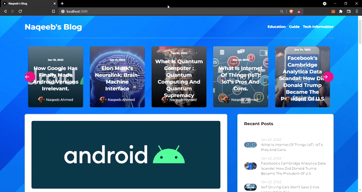

# Naqeeb's Blog


## Introduction
This is a code repository for the Naqeeb's Blog 

With featured and recent posts,full markdown articles, author information, comments, and much more, this fully responsive CMS Blog App. And what's best of all is that you and your clients can manage the blog from a dedicated Content Management System.

I have used GraphCMS for Content Management System. GraphCMS is a headless content management system based on GraphQL technology enabling seamless integration with any application.

## Technology Used
React Js, Next Js, Tailwind CSS, GraphQL and GraphCMS

## Getting Started

First, run the development server:

```bash
npm run dev
# or
yarn dev
```

Open [http://localhost:3000](http://localhost:3000) with your browser to see the result.

